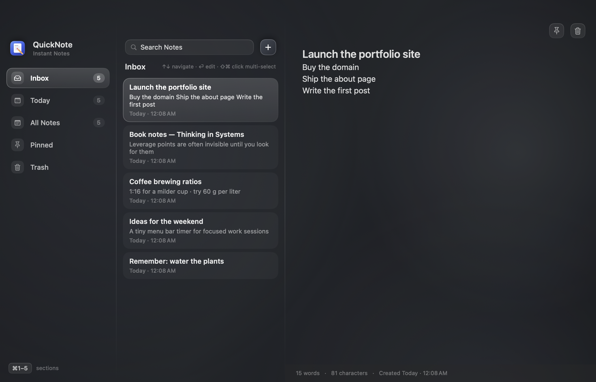
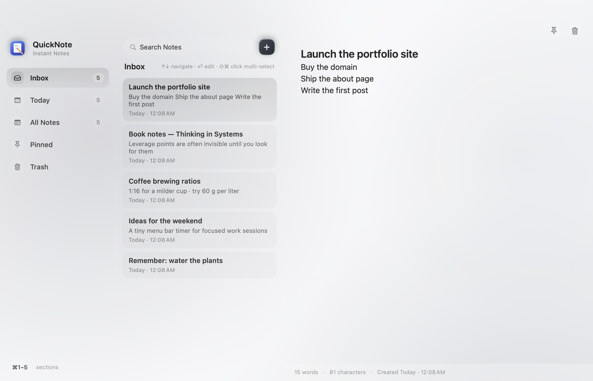
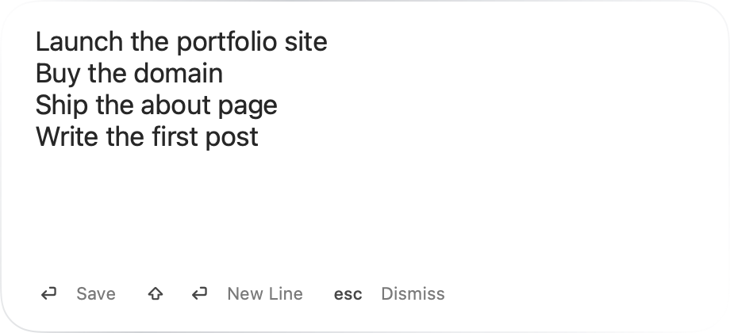

<div align="center">


# QuickNote

**Capture a thought before it disappears.**

A native macOS instant-notes utility, press one shortcut from anywhere,
type, hit Return. The note is saved on your Mac and the panel vanishes.

[](https://github.com/mohdhadi01/QuickNote-Mac)
[](https://github.com/mohdhadi01/QuickNote-Mac)
[](https://github.com/mohdhadi01/QuickNote-Mac)
[](https://github.com/mohdhadi01/QuickNote-Mac)
[](https://github.com/mohdhadi01/QuickNote-Mac/releases/latest)

</div>



QuickNote is built for the moment an idea shows up mid-task: no window hunting,
no new-note button, no title field, no account. One keystroke, the thought,
done, and since the notes live in a local SwiftData database, nothing ever
leaves your Mac.

<p align="center"><a href="https://github.com/mohdhadi01/QuickNote-Mac/releases/latest/download/QuickNote-1.0.dmg"></a></p>

> **First launch:** the build isn't notarized yet, so macOS shows a one-time
> warning. Click **Done**, then open **System Settings → Privacy & Security →
> Open Anyway → Open**. (Or run `xattr -cr /Applications/QuickNote.app`.)

## What it looks like

| Light | Quick capture |
| --- | --- |
|  |  |

The full experience, shortcut demo, feature tour, blog, lives on the
marketing site: **[QuickNote-Website](https://github.com/mohdhadi01/QuickNote-Mac-Mac-Website)**.

## Features

- **⌃⇧Space from anywhere**, a Liquid Glass panel (non-activating `NSPanel`) works over any app, Space, and full-screen apps; no Accessibility permission, ever (the hotkey uses Carbon `RegisterEventHotKey`).
- **First line becomes the heading**, quick captures have no title field; the first line renders as a heading visually, stored text is never modified.
- **Keyboard first**, ↑/↓ walk the list, ⌘1–5 switch sections, ⌘F searches, Return opens, Esc is always contextual.
- **Multi-select & merge**, ⌘-click toggles, ⇧-click ranges, ⌘A selects all; batch Pin/Copy/Merge/Trash.
- **Drag & drop**, drag notes onto sidebar sections to organize; drop text or `.txt` files to create notes instantly.
- **Pin, search, trash**, pinned shortlist, debounced global search, restore-or-purge Trash.
- **Quietly native**, launch at login (silent), menu bar companion, light/dark that follows the system, Reduce Motion/Transparency aware.

<div align="center">

⌃ &nbsp;⇧ &nbsp;**Space** &nbsp;→&nbsp; *type* &nbsp;→&nbsp; **↩** &nbsp;=&nbsp; **saved**

</div>

## Download

Grab the latest DMG from [**Releases**](https://github.com/mohdhadi01/QuickNote-Mac/releases/latest),
macOS 26+, Apple silicon & Intel, ~3 MB, free. Drag QuickNote to Applications
and you're done. The step-by-step first-launch instructions are in the release
notes and inside the DMG.

## Build & run

Requirements: Xcode 26+ (built with Xcode 27 on macOS 26.6), macOS 26+.

```bash
open QuickNote.xcodeproj        # then ⌘R in Xcode
# or
xcodebuild -project QuickNote.xcodeproj -scheme QuickNote -configuration Debug build
xcodebuild -project QuickNote.xcodeproj -scheme QuickNote -configuration Release build
```

The app is signed with App Sandbox; no special permissions are requested
(no Accessibility permission needed, the hotkey uses Carbon
`RegisterEventHotKey`).

### Packaging

```bash
Scripts/MakeDMG.sh              # signed DMG with a real drag-and-drop installer window
```

Notarized builds (requires a paid Apple Developer Program membership):

```bash
SIGN_IDENTITY="Developer ID Application: NAME (TEAMID)" \
NOTARIZE_APPLE_ID=you@example.com \
NOTARIZE_PASSWORD=app-specific-password \
NOTARIZE_TEAM_ID=TEAMID \
Scripts/MakeDMG.sh
```

## Tests

```bash
xcodebuild -project QuickNote.xcodeproj -scheme QuickNote \
  -destination 'platform=macOS' -only-testing:QuickNoteTests test      # 65 unit tests

xcodebuild -project QuickNote.xcodeproj -scheme QuickNote \
  -destination 'platform=macOS' -only-testing:QuickNoteUITests test    # UI tests
```

UI tests run against a fresh in-memory store and use documented QA launch
hooks (below) because headless runs cannot synthesize hardware keyboard
events. Real typing should be verified manually.

## QA launch flags (intentional, documented hooks)

| Flag | Effect |
| --- | --- |
| `-quicknote.debugShowCapture` | Opens the capture panel 1 s after launch |
| `-quicknote.debugOpenSettings` | Opens Settings 1 s after launch |
| `-quicknote.debugSnapshot` | Renders light+dark PNGs of all windows to the app container's `tmp/quicknote-snapshots/`, then quits |
| `-quicknote.demoData` | Seeds the curated sample notes (used for screenshots, never real user data) |
| `-quicknote.forceOnboarding` | Always starts at onboarding |
| `-quicknote.seedNote <text>` | Seeds one note at launch |
| `-quicknote.inMemoryStore 1` | Fresh in-memory store per launch |

## Manual test checklist

- Hotkey from Safari/Xcode/Terminal/Finder/Slack, full-screen apps, each Space,
  each connected display (panel follows the cursor's screen).
- Rapid repeated hotkey (toggles the panel), rapid repeated Return (single note).
- Display disconnect while the panel is open (it repositions).
- Light/dark, Reduce Motion, Reduce Transparency, Increased Contrast.
- Settings: re-record shortcut (try one already in use to see the error),
  Launch at Login toggle, panel position.
- Restart the app: notes persist.

## Architecture & project layout

- **Persistence:** SwiftData with graceful recovery, an unreadable store is
  quarantined (never deleted) and a fresh one is created; the app surfaces a
  banner instead of crashing. Notes are CloudKit-friendly by design (stable
  UUIDs, createdAt/updatedAt, no transient UI state).
- **Settings:** Launch at Login (`SMAppService`), shortcut recorder, panel
  position, Record Source Application (**off by default**, stores only app
  name + bundle ID), appearance (system/light/dark).
- **Menu bar:** New Quick Note, New Note, Open Notes, Search Notes,
  Launch at Login toggle, Settings, Quit.
- **Onboarding:** a single card on first launch, no accounts, no permissions.
- **Accessibility:** full labels, keyboard navigation, VoiceOver-friendly rows.

```
QuickNote/
├── App/            # entry point, composition root, lifecycle, coordinator
├── Core/           # Note model, repository, persistence, formatting, errors
├── Platform/       # Carbon hotkey, NSPanel + placement, login item, a11y flags
├── Services/       # settings, notes, search, shortcut services
├── Features/       # QuickCapture, Notes, Settings, MenuBar, Onboarding
├── DesignSystem/   # tokens, typography, motion
└── Support/        # logging (OSLog), QA snapshot tooling
QuickNoteTests/     # 65 unit tests (all green)
QuickNoteUITests/   # hermetic UI tests
Scripts/            # DMG packaging, icon generator
docs/               # README screenshots
```

Design rule: *every extra interaction is a product bug unless it provides real
value*, shortcut → type → Return stays sacred.

## Privacy

No account. No cloud. No sync. No telemetry. QuickNote has no network code at
all, notes live in a local SwiftData store on your Mac.

---

<div align="center">

**[Download the DMG](https://github.com/mohdhadi01/QuickNote-Mac/releases/latest)** ·
**[Website repo](https://github.com/mohdhadi01/QuickNote-Mac-Mac-Website)**

</div>
